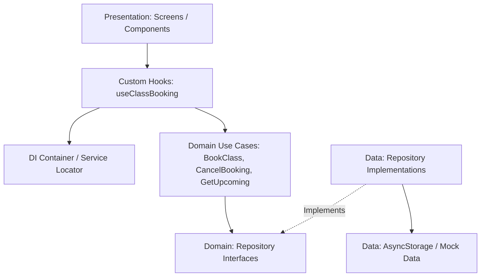

# Design: add-class-booking

## Context

ClaseFit requiere un MVP móvil offline-first para resolver el sobrecupo y desorden en reservas de clases grupales. La app funcionará con datos predefinidos (`mock-data/clases.json`) y operará sin conexión a backend remoto para un único socio preautenticado ("Laura Gómez", ID: `S-0001`).

## Goals / Non-Goals

**Goals:**
- Implementar una arquitectura desacoplada en 3 capas (Domain, Data, Presentation) bajo Clean Architecture estricta.
- Garantizar la ejecución offline de todo el flujo de consulta, reserva y cancelación de clases.
- Persistir las reservas y datos en almacenamiento local del dispositivo.
- Cumplir de forma verificable y testeable las reglas de negocio RN-01 a RN-04.

**Non-Goals:**
- Implementar sincronización remota o gestión de conflictos con servidores externos.
- Desarrollar login o soporte para múltiples perfiles de usuario.

## Decisions

### 1. Arquitectura en 3 capas (Clean Architecture)

- **Domain Layer (`src/domain`):**
  - Contiene las entidades puras (`ClassItem`, `Booking`, `Member`), objetos de valor (`ClassDate`, `BookingStatus`), contratos de repositorio (`IClassRepository`, `IBookingRepository`) y casos de uso (`GetUpcomingClassesUseCase`, `BookClassUseCase`, `CancelBookingUseCase`, `GetMemberBookingsUseCase`).
  - Es TypeScript puro, sin dependencias de React, React Native o librerías externas.
  - Implementa y valida rigurosamente las reglas RN-01 a RN-04.

- **Data Layer (`src/data`):**
  - Implementa los contratos de repositorio (`ClassRepositoryImpl`, `BookingRepositoryImpl`).
  - Utiliza `MockClassDataSource` para leer y transformar `clases.json`.
  - Utiliza `AsyncStorageBookingDataSource` para serializar y almacenar las reservas en el dispositivo.
  - Contiene mappers y DTOs para transformar los datos sin contaminar las entidades del dominio.

- **Presentation Layer (`src/presentation`):**
  - Implementa la interfaz de usuario con Expo/React Native (`ClassListScreen`, `MyBookingsScreen`).
  - Utiliza Custom Hooks (`useClassBooking`, `useMemberBookings`) que orquestan los casos de uso inyectados a través del Service Locator (`src/di/container.ts`).
  - Componentes modulares y desacoplados para listas, tarjetas de clase e indicadores de cupos.

### 2. Cálculo de fechas y zona horaria

- **Offset y Normalización:** Cada clase define `diaOffset` (0 = hoy, 1 = mañana, 2 = pasado mañana) y `hora` (formato "HH:mm"). La fecha real se calcula con una función de utilidad de dominio pura (`calculateClassDateTime(baseDate, diaOffset, horaString)`) basada en la fecha actual del dispositivo y la zona horaria `America/Bogota`.
- **Filtro de clases pasadas:** Al listar clases, se calcula `inicioClase <= fechaActual`. Si ya inició, se excluye del catálogo disponible.
- **Regla de 2 horas (RN-04):** Para cancelar, se calcula `diferenciaHoras = (inicioClase - ahora) / (1000 * 60 * 60)`. Si `diferenciaHoras < 2`, se rechaza la cancelación con el mensaje especificado.

### 3. Manejo del estado offline y persistencia en memoria

- **Caché en Memoria + Hidratación:** La aplicación mantiene las reservas en memoria para respuesta instantánea de la UI y las sincroniza atómicamente con `@react-native-async-storage/async-storage` bajo la clave `@clasefit:bookings_v1`.
- **Cálculo reactivo de cupos:** Los cupos disponibles de cada clase se calculan dinámicamente: `cuposDisponibles = cupoTotal - (ocupados + reservasLocalesActivas)`.
- **Recuperación Offline:** Al inicializar la app, el repositorio lee AsyncStorage; si no existen reservas guardadas, inicializa una lista vacía.

### 4. Alternativa descartada

- **Descartado: Manejo de estado con Redux Toolkit / Zustand.**
- **Motivo de descarte:** Para el alcance del MVP, introducir una biblioteca externa de estado global (como Redux Toolkit o Zustand) agrega sobrecarga innecesaria y acoplamiento fuera de Clean Architecture. El patrón Repository en la capa de datos combinado con Custom Hooks en Presentation y un Service Locator simple (`container.ts`) proporciona reactividad, bajo acoplamiento e independencia total del framework sin dependencias pesadas.

## Risks / Trade-offs

- **[Riesgo: Cambio manual de fecha u hora del dispositivo]** → *Mitigación:* Centralizar la obtención de la fecha en un servicio o función inyectable (`IDateProvider`) para facilitar tests deterministas y evitar discrepancias de zona horaria.
- **[Riesgo: Pérdida de datos locales por limpieza de caché del sistema]** → *Mitigación:* Mantener la estructura de serialización en AsyncStorage simple y auto-recuperable desde `clases.json`.
